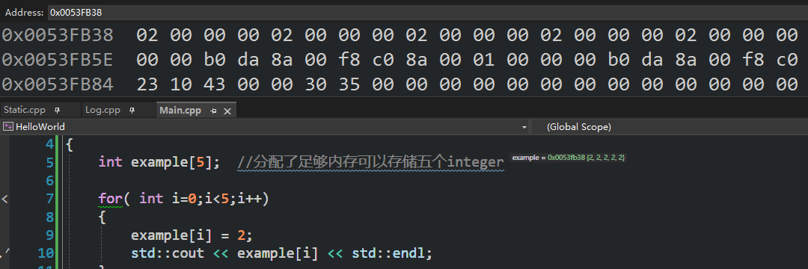

### [Arrays in C++](https://www.youtube.com/watch?v=ENDaJi08jCU&list=PLlrATfBNZ98dudnM48yfGUldqGD0S4FFb&index=30)

数组的每一个index对应一个变量，超出index范围，可能会导致内存访问冲突（Memory access violation）

> [!note] EXample 21.1
```cpp
int main()
{
    int example[5];  //分配了足够内存可以存储五个integer
    example[0] = 2;
    example[4] = 4;
//    example[-1] = 5;
// example[5] = 2; //越界访问，可能会导致程序崩溃
    std::cout << example[0] << std::endl;   // 2
    std::cout << example << std::endl;      // 0064FC30(内存地址)，因为它是一个指针

    std::cin.get();
}
```

#### For loops
Array总是伴随着For loops,因为 for 循环可以在特定范围内使用索引遍历。 所以如果我们想要设置数组中的每个值，一个很好的方式就是通过 for 循环实现。

有关数组很重要的一点就是数组中的数据是连续的，也就是说数据都放在了一行内存分配：每个integer都是 4 bytes，所以我们这里得到了一行被分成几个 4 bytes 的 20 bytes 的内存（不是字面意义分割）

index索引其实是地址偏移，偏移=索引 x 每个元素大小 比如 example[2] 的地址偏移就是 2 x sizeof(int) = 8 bytes

↓一个指向包含 5 个整数的内存块的整形指针


> [!note] EXample 21.2
```cpp
int main()
{
    int example[5];  //分配了足够内存可以存储五个integer
    int *ptr = example; //指针指向example数组的首地址   
    for( int i=0;i<5;i++)  // i<=4有性能问题，因为你在做和小于和等于比较
    {
        example[i] = 2; //每一个成员都等于2
        std::cout << example[i] << std::endl;
    }
    example[2] = 5;
    *(ptr+2) = 6; //指针加法，指针加2等于example[2],所以example[2] = 6
    // *(int*)((char*)ptr +8) = 6; //指针加法，地址加8，等于指针+2
    std::cin.get();
}
```

另一件要考虑的是memory indirection(内存间接寻址)，意思是我们有一个指针，指针指向另一个保存着我们实际数组的内存块，这会产生一些内存碎片和缓存损失。

> [!note] EXample 21.3
```cpp
int main()
{
    int example[5];  //steak,live until the end of the scope
    for ( int i=0;i<5;i++) 
    {
        example[i] = 2; 
    }
    int* another = new int[5]; //heap,live until delete
    for ( int i=0;i<5;i++)  
    {
        another[i] = 2; 
    }
    delete[] another; //delete the memory allocated on the heap
    std::cin.get();
}
```
`p -> p -> array`
> [!note] C++ 11 std::array
> 这是一个内置数据结构，定义在 C++11 的标准库中，很多人用来代替原生数组因为有诸多优点。 比如边界检查，有记录数组的大小。

> [!note] 原生数组的大小
> 我们实际上无法计算原生数组的大小，不过删除这个数组时，编译器要知道我们需要释放多少内存。不过很麻烦，而且不能相信它，永远不要再数组内存中访问数组的大小。

> [!note] EXample 21.3
```cpp
class Entity
{
    public:
int example[5]; 
//    int count = sizeof(example) / sinzeof(int); 
//sizeof(a) = 20, sizeof(int) = 4, sizeof(char) = 1
//这是一个用于访问其尺寸的办法，但不能相信它，永远不要再数组内存中访问数组的大小
// 不如这么写：

static const int exampleSize = 5;
int example[size]; //这样就可以了

//又或者：
std::array<int, 5> another; //C++11的array类，类似于vector，但没有动态大小

Entity() 
{

    for ( int i=0;i<another.size();i++) 
        another[i] = 2; 
}
};

int main()
{
   Entity e;
    std::cin.get();
}
```
